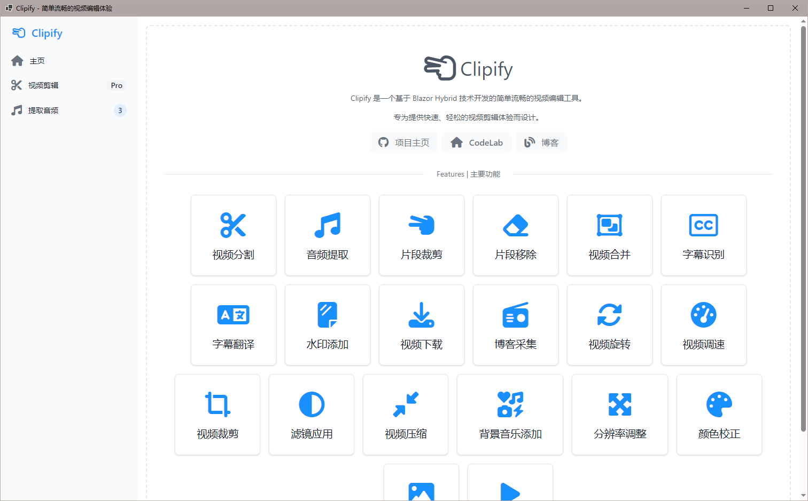
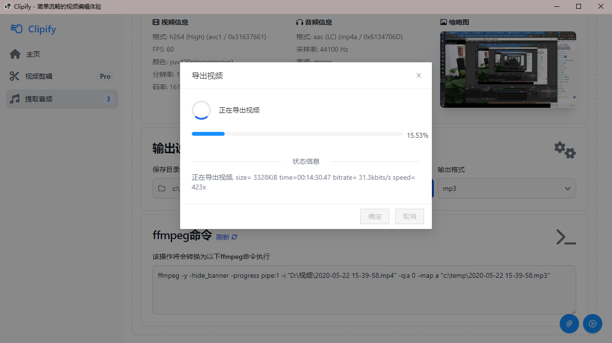

# Clipify

**Clipify** 是一个基于 Blazor Hybrid 技术开发的简单流畅的视频编辑工具，专为提供快速、轻松的视频剪辑体验而设计。

## 简介

Clipify 使用了强大的 ffmpeg 引擎作为后台支持，允许用户通过直观的界面快速进行视频剪辑、转换等操作。无需复杂设置，安装后即可开始使用。

### 特性

- 简单直观的用户界面
- 支持多种视频剪辑操作（裁剪、合并、分割、提取音频等）
- 高效的视频处理，得益于 ffmpeg 的强大性能
- 即装即用，无需复杂配置
- 多格式支持：MP4, AVI, MKV 等

## 截图
主界面



| 音频提取                 | 导出视频                 |
|----------------------|----------------------|
|  |  |


## 安装

1. 下载并安装 Clipify 安装包。
2. 安装过程中，确保 ffmpeg 已包含在项目中，无需手动配置。
3. 安装完成后，打开 Clipify，开始您的视频编辑之旅。

## 使用方法

1. 打开 Clipify。
2. 导入你需要剪辑的一个或多个视频文件。
3. 选择所需的剪辑操作，例如：裁剪、合并、分割等。
4. 点击“导出”，选择导出路径和格式。
5. Clipify 将在后台使用 ffmpeg 处理视频，并生成结果文件。

## 依赖

- [.NET 8+](https://dotnet.microsoft.com/download/dotnet/8.0)
- [ffmpeg](https://ffmpeg.org/)（已集成在项目中，无需额外安装）

## 技术栈

- **WinForms**：用于桌面应用程序的用户界面开发。
- **Blazor**：提供现代化、交互性强的前端体验。
- **ffmpeg**：作为后台处理引擎，负责视频的剪辑与转换。

## Build

### tailwindcss

```bash
cd Clipify.Forms
npx tailwindcss -i .\wwwroot\css\tailwind.css -o .\wwwroot\css\tailwind.min.css --watch
```

## 贡献

欢迎对本项目进行贡献，您可以通过以下方式参与：

1. Fork 此仓库
2. 创建自己的分支 (`git checkout -b feature/AmazingFeature`)
3. 提交您的修改 (`git commit -m 'Add some AmazingFeature'`)
4. Push 到分支 (`git push origin feature/AmazingFeature`)
5. 创建一个新的 Pull Request

## 许可证

本项目使用 [GPLv3 许可证](./LICENSE)。
