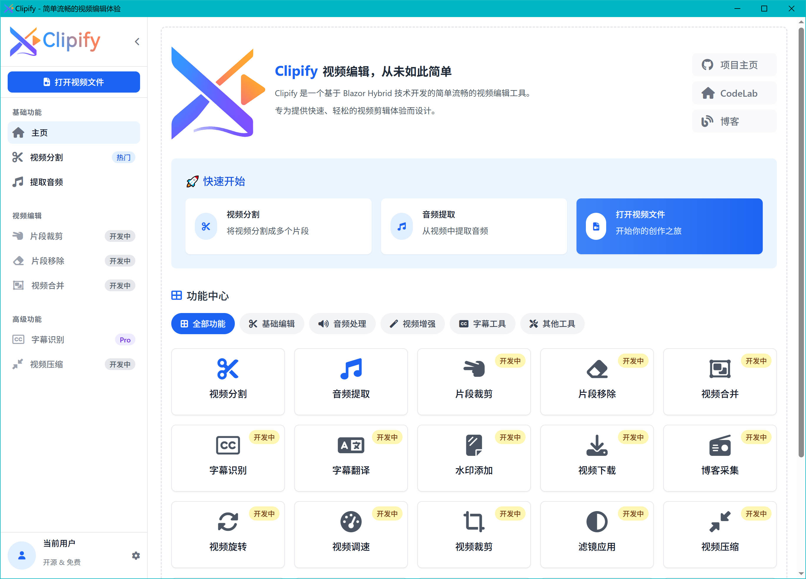
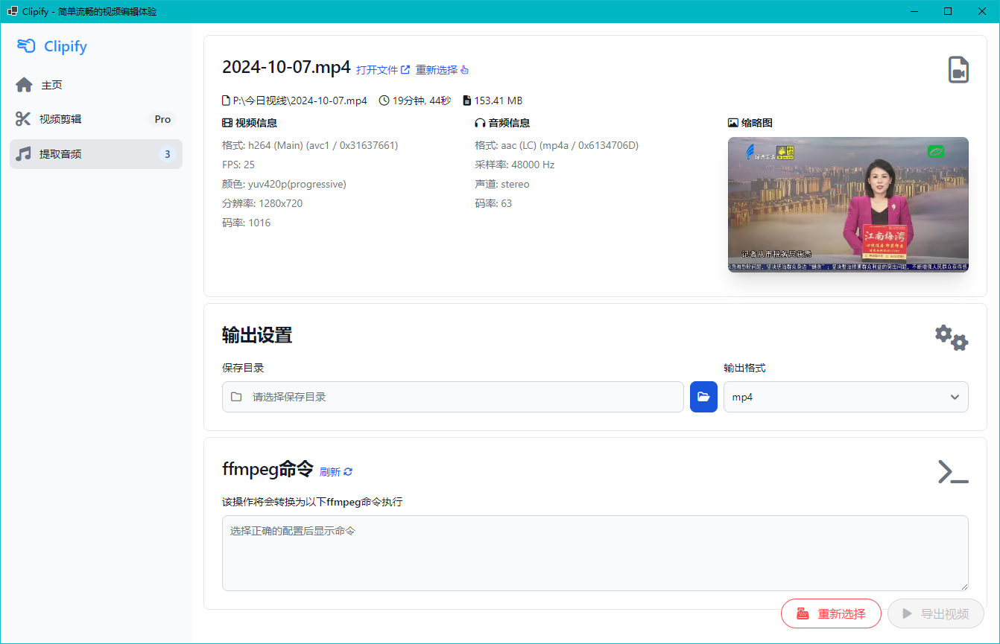
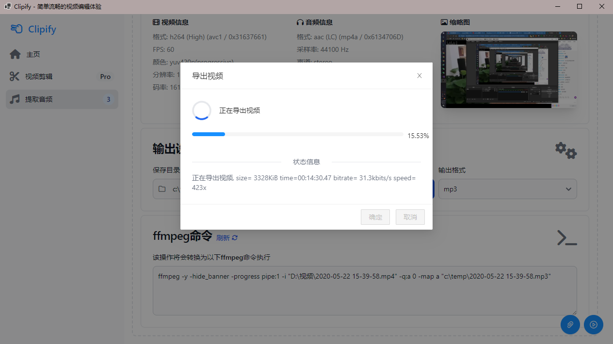

# Clipify

**简单流畅的本地视频处理工具** —— 保留 Blazor Hybrid 的桌面体验，正在重建为跨平台、可脚本化、可被 AI Agent 调用的媒体工作台。

设计笔记：[用 Blazor Hybrid 打造简洁高效的视频处理工具](https://blog.deali.cn/Blog/Post/6a903b1c6fb2487f)  
现代化方案：[docs/modernization-plan.md](./docs/modernization-plan.md)

---

## 正在发生的事

Clipify 不只是在旧代码上堆功能。我们在保留「本地 Blazor + FFmpeg」核心特色的同时，把产品重构成三层清晰边界：

| 理念 | 含义 |
|------|------|
| **一套能力，三个入口** | GUI、CLI、MCP 共用同一套 Application 与任务系统，不各写一份处理逻辑 |
| **任务有独立生命周期** | 媒体处理离开弹窗：可排队、可取消、可重试、可查历史，崩溃后状态可解释 |
| **跨平台桌面，仍是 Hybrid** | 目标宿主 PhotinoX（Win / macOS / Linux），Razor 继续跑在本地 .NET 进程里 |
| **给人和 Agent 同样可靠** | `clipify` 命令行给脚本与 CI；`clipify-mcp` 给 Claude Code 等 Agent，路径与风险可控 |

当前仓库里，**新架构骨架已落地**（.NET 10、Domain / Application、EF Core SQLite 任务内核、Hosting Worker、三平台 CI）。下一阶段会接入自研 FFmpeg 基础设施，再依次补齐 CLI、MCP 与新 UI。

> **现阶段日常可用版本仍是 Windows 上的 WinForms + Blazor Hybrid。**  
> 新跨平台版本尚未功能对等；WinForms 进入过渡维护，只修阻塞迁移或严重缺陷。

---

## 产品愿景（你很快会用到的）

```text
                 ┌─────────────┐  ┌─────────────┐  ┌──────────────┐
                 │  Desktop UI │  │  clipify    │  │  clipify-mcp │
                 │  (PhotinoX) │  │  CLI        │  │  (stdio)     │
                 └──────┬──────┘  └──────┬──────┘  └──────┬───────┘
                        │                │                 │
                        └────────────────┼─────────────────┘
                                         ▼
                              Clipify.Application
                              （用例 / 校验 / 任务编排）
                                         ▼
                         ┌───────────────┴───────────────┐
                         ▼                               ▼
                  异步媒体任务系统                    FFmpeg / ffprobe
               （SQLite · Claim/Lease）              （自管进程 · 进度 · 取消）
```

**对用户**：导入视频 → 选操作 → 导出；任务在后台跑，关掉某个对话框也不会「任务消失」。  
**对开发者 / CI**：同一套能力用 CLI 跑通自动化。  
**对 AI Agent**：通过 MCP 发现工具、提交长任务、轮询结果——而不是让模型随便拼 Shell 命令。

---

## 当前可做的事（WinForms 版）

- 直观的 Blazor Hybrid 界面
- 常见视频操作：裁剪、合并、分割、提取音频等
- 基于 FFmpeg 的本地处理，即装即用
- 多格式支持：MP4、AVI、MKV 等

### 截图

主界面



| 音频提取 | 导出视频 |
|----------|----------|
|  |  |

### 安装与使用（现行版本）

1. 下载并安装 Clipify；安装包已包含所需 FFmpeg，无需单独配置。
2. 打开应用，导入一个或多个视频。
3. 选择操作（裁剪、合并、分割等），导出时选择路径与格式。
4. 后台由 FFmpeg 处理并生成结果文件。

**依赖（现行 WinForms）**

- [.NET 8+](https://dotnet.microsoft.com/download/dotnet/8.0)（发布包通常自带运行时）
- [FFmpeg](https://ffmpeg.org/)（Windows 可用 [scoop](https://scoop.sh/) 安装；安装包场景一般已内置）

---

## 现代化进度

| 阶段 | 内容 | 状态 |
|------|------|------|
| 0–1 | 安全基线、.NET 10 解决方案骨架、中央包管理、CI | 完成 |
| 2 | 删除不可用的 MAUI 半成品 | 完成 |
| 3 | Domain / Application、可持久化异步任务内核 | 完成 |
| **4** | **自研 FFmpeg 基础设施与真实媒体任务** | **下一步** |
| 5 | 共享 Hosting 与 `clipify` CLI | 计划中 |
| 6 | `clipify-mcp`（Agent 一等入口） | 计划中 |
| 7–8 | PhotinoX 桌面壳 + Blazor Blueprint UI | 计划中 |
| 9–10 | 与 WinForms 功能对等、归档旧版、发布完善 | 计划中 |

集成分支：`modernization/trunk`（已合入 `master`）。阶段工作从 trunk 派生，例如 `modernization/phase-4-ffmpeg`。

完整决策与验收标准见 [modernization-plan.md](./docs/modernization-plan.md)。

---

## 技术栈

| 层 | 现行（过渡） | 新架构目标 |
|----|--------------|------------|
| 运行时 | .NET 8（Forms） | **.NET 10** |
| 桌面 | WinForms + Blazor Hybrid | **PhotinoX.Blazor**（跨平台 WebView） |
| UI | Ant Design / Flowbite 等 | **Blazor Blueprint** + Tailwind |
| 媒体 | xFFmpeg.NET | **自管 FFmpeg CLI**（定位、进度、取消、清理） |
| 任务 | 绑定在弹窗组件上 | **SQLite + EF Core 10** 持久化任务系统 |
| 入口 | GUI 为主 | **GUI · CLI · MCP** 三入口共享核心 |

新代码布局：

```text
src/
  Clipify.Domain/        # 任务模型与状态机
  Clipify.Application/   # 用例与端口
  Clipify.Persistence/   # EF Core · SQLite · 原子 Claim
  Clipify.Hosting/       # Worker 与组合根
  Clipify.FFmpeg/        # （阶段 4）媒体基础设施
  Clipify.Cli/           # （阶段 5）命令行
  Clipify.Mcp/           # （阶段 6）MCP Server
  Clipify.Desktop/       # （阶段 7）跨平台壳
  Clipify.UI/            # （阶段 8）共享 Blazor UI
tests/                   # 自动化测试
```

---

## Build

需要 [.NET 10 SDK](https://dotnet.microsoft.com/download/dotnet/10.0)（见仓库 `global.json`）。

### 新解决方案（推荐用于开发新架构）

```bash
dotnet restore Clipify.sln
dotnet build Clipify.sln -c Release --no-restore
dotnet test Clipify.sln -c Release --no-build --no-restore
```

### 现行 WinForms 客户端（功能参考 / 过渡维护）

前端资源使用 pnpm 与 gulp（建议 Node.js v20）：

```bash
npm i -g pnpm gulp-cli
cd Clipify.Forms
pnpm i
gulp move
pnpm run tailwind:watch   # 或一次性生成 tailwind.min.css
```

发布示例：

```bash
dotnet restore
dotnet publish -r win-x64 -c Release -p:PublishSingleFile=true
```

样式基于 [Tailwind CSS](https://tailwindcss.com/)。新 UI 阶段将改用 Blazor Blueprint 预编译组件 CSS + Clipify 自定义 Tailwind 构建。

---

## 贡献

欢迎参与现代化与功能完善：

1. Fork 本仓库  
2. 从 `modernization/trunk` 派生阶段或功能分支（例如 `modernization/phase-4-ffmpeg`）  
3. 保持阶段小而可验证；大改动请对照 [modernization-plan.md](./docs/modernization-plan.md)  
4. 提交 PR  

讨论与设计笔记也欢迎开 Issue。

---

## 许可证

本项目使用 [GPLv3 许可证](./LICENSE)。
